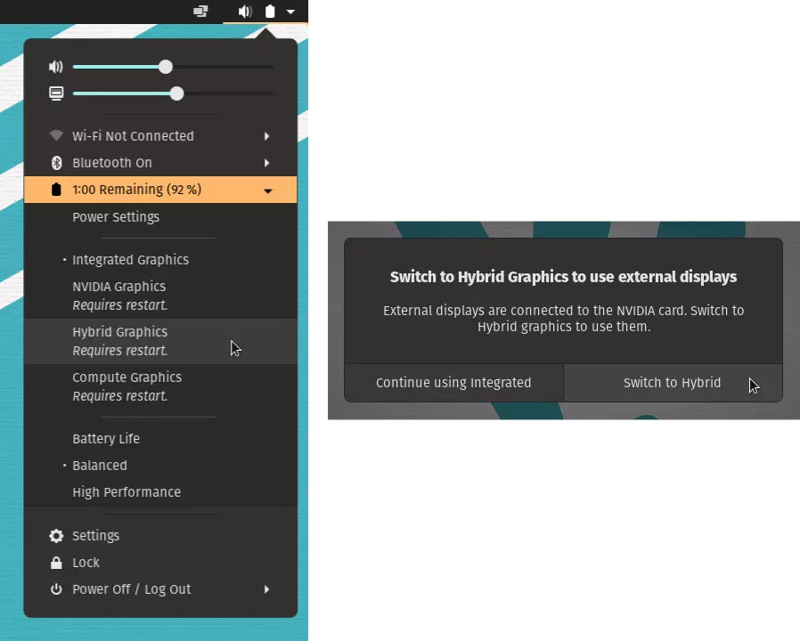

# System76 Power Management

**gnome-shell-extension-system76-power** is a GNOME Shell extension that adds graphical integration with the [system76-power](https://github.com/pop-os/system76-power) daemon, including:

- Power profiles (and graphics-switching profiles on applicable systems) in the top-right menu
- Prompting to switch graphics modes when necessary to use a hot-plugged display

